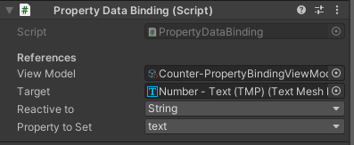

# Property Binding

### Property Binding Component

Para ser uso de esta necesitamos añadir el component PropertyDataBinding a un Gameobject.

<figure><figcaption></figcaption></figure>

* `ViewModel`**:**es la referencia al PropertyBindingViewModelSO al que se subscribe.
* `Target`: Es el Componente al cual se le van a cambiar una property.
* `Reactive to`: Es la Variable reactiva a la que este DataBinding se va a subscribir.
* `Property to set`: Es la property que va a cambiar segun el valor de la variable.

### Property Binding ViewModel

Este ViewModel es un ScriptableObject y contiene un array de ReactiveProperty. Las variables tienen un valor por defecto que esta expuesto en el inspector.\
Para crear uno vamos a la Project View y Create:&#x20;

<figure><figcaption></figcaption></figure>

### Reactive Property

Las ReactiveProperty son ScriptableObjects, estas son variables que reaccionan cuando el viewmodel los ejecuta y los DataBinding se subscriben.

<figure><figcaption></figcaption></figure>

