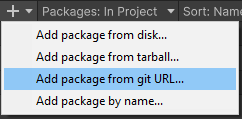

# Instalacion

1. Para instalar este Framewotk primero necesitamos instalar estos package:
   * **Extenject**:[https://assetstore.unity.com/packages/tools/utilities/extenject-dependency-injection-ioc-157735](https://assetstore.unity.com/packages/tools/utilities/extenject-dependency-injection-ioc-157735)&#x20;
   * **UniRx**: [https://github.com/neuecc/UniRx.git?path=Assets/Plugins/UniRx/Scripts](https://github.com/neuecc/UniRx.git?path=Assets/Plugins/UniRx/Scripts)
2. Luego, abrir PackageManager.
3. Click en buton de `+`.
4. Click en Add package from git URL.
   * 
5. Copiar el link: [https://github.com/LaloBerro/UnityPackage-MVVMFramework.git](https://github.com/LaloBerro/UnityPackage-MVVMFramework.git) y darle a Add.
   * .png>)
6. Listo!
